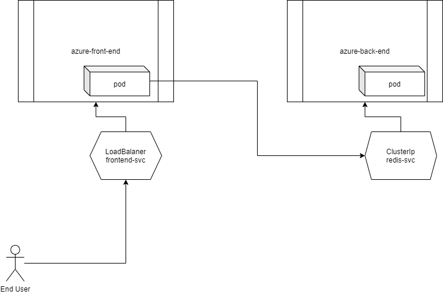

## Azure "Vote App" with Redis Backend



1. Deploy all the artefacts with single command:

    ```bash
    ## the DOT at the end all command would pass ALL files with YML and YAML extension
    ## to kubectl for processing !
    kubectl apply -f . 
    kubectl get pods -o wide
    kubectl get deploy 
    ```

2. Check the services

    ```bash
    kubectl get svc 
    ```

3. Access application using url
    http://localhost:8082

> NOTE: If deployed on AKS, use public ip from step 2