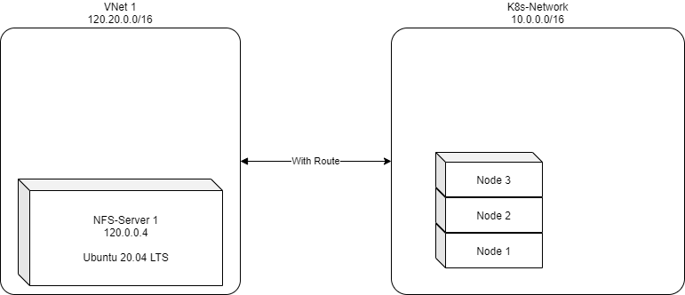

# Dynamically Provisioning NFS Volumes 



1. Setup nfs-server-1 with following script [here](./setup-nfs.sh) is the shell-script to download.

2.  Once script is saved, launch it with "sudo" privileges.

    ```bash
    $ sudo sh setup-nfs.sh
    ```

3.  Now, your NFS Server with IP 120.20.0.4 is now ready.

4.  Install the "helm" in your local system for installing  NFS Storage provisioner

5.  Now, use following commands to install the nfs-storage-provisioner

    ```bash
    # Please set following variables
    $ SHARED_DIR=/mnt/nfsdir
    $ NFS_SERVER=120.20.0.0

    $ helm repo add nfs-subdir-external-provisioner https://kubernetes-sigs.github.io/nfs-subdir-external-provisioner/
    $ helm install nfs-provisioner nfs-subdir-external-provisioner/nfs-subdir-external-provisioner  --set nfs.server=$NFS_SERVER --set nfs.path=$SHARED_DIR
    ```

6.  Now, lets deploy the [sample application](./deploy.yml) and [persistent-volume-claim](./my-pvc.yml)

    ```bash
    $ kubectl apply -f my-pvc.yml
    $ kubectl get pvc
    $ kubectl get pv
    $ kubectl apply -f deploy.yml
    $ kubectl get po -l app=pv-pods
    ```

7.  Now, carefully run following command to get inside FIRST POD of deployment.

    ```pwsh
    $ kubectl exec -it  $(kubectl get po -l app=pv-pods -o=jsonpath="{.items[0].metadata.name}") -- sh
    $ cd /usr/share/nginx/html
    $ echo "Hello World" > file1.txt
    $ exit
    ```

8.  Now, test the file inside volume from SECOND pod in deployment.

    ```pwsh
    $ kubectl exec -it  $(kubectl get po -l app=pv-pods -o=jsonpath="{.items[1].metadata.name}") -- sh
    $ cd /usr/share/nginx/html
    $ ls
    $ cat file1.txt
    $ exit
    ```

9.  Clean-Up (Delete the example application)

    ```pwsh
    $ kubectl delete -f deploy.yml
    $ kubectl delete -f my-pvc.yml
    ```

10. Clean-Up (Delete the storage provisioner)

    ```pwsh
    $ helm uninstall nfs-provisioner
    ```